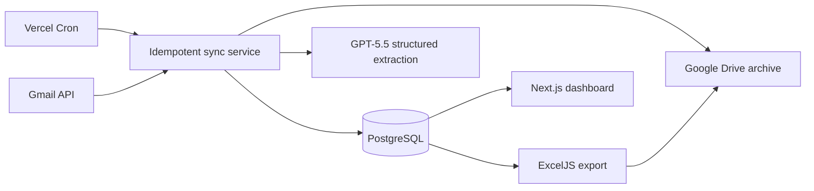

# KHOPS Referral Tracker

Personal referral-incentive tracking for KHOPS operations. The app monitors one Gmail inbox through the official Gmail API, reads the email thread and supported attachments, extracts structured referral data with GPT-5.5, persists it in PostgreSQL, tracks approval stages, and produces monthly centre-wise Excel workbooks.

This is a single-owner application. It has no in-app authentication by design; protect the deployed site with Vercel Deployment Protection, an access proxy, or equivalent network-level access control before handling real patient data.

## What it does

- Monitors only the configured operations Gmail address (default: `team98foperations@gmail.com`).
- Finds broad candidate threads using Gmail search (`KH` + `Referral Incentive`) instead of hardcoded subject formats.
- Uses GPT-5.5 structured extraction to classify candidates and read email bodies, PDFs, images, forms, and tables.
- Supports normal requests and special requests with multiple beneficiaries.
- Stores each beneficiary and amount independently.
- Archives Gmail attachments to a private Google Drive folder, with safe in-app preview/download routes.
- Detects approval progress from chronological Gmail thread content, not Gmail labels.
- Prevents duplicate imports using Gmail thread, message, and attachment constraints.
- Provides dashboard cards, request search/filters, request details, Gmail links, timelines, attachments, and personal notes.
- Exports one Excel worksheet per centre for any selected month.

## Technology

| Area | Implementation |
| --- | --- |
| Web app | Next.js 15, TypeScript, Tailwind CSS, Shadcn-style reusable UI components |
| Database | PostgreSQL with Prisma ORM and migrations |
| Gmail and Drive | Google APIs with OAuth refresh tokens |
| AI | OpenAI Responses API using configurable GPT-5.5 model by default |
| Documents | Gmail MIME parsing, PDF/image file inputs, Google Drive archival |
| Export | ExcelJS |
| Scheduler | Vercel Cron invokes a protected sync endpoint every five minutes; the database setting defaults to an effective ten-minute interval |
| Deployment | Vercel + managed PostgreSQL |

## Architecture



The implementation is modular. `gmail`, `documents`, `ingestion`, `extraction`, `approval-status`, `exports`, `settings`, and `requests` are independent server domains. This keeps future KHOPS integration straightforward.

## Project layout

```text
src/
  app/                    Pages and route handlers
  components/             Reusable app and UI components
  server/
    approval-status/      Timeline detection rules and AI fallback
    db/                   Prisma client
    documents/            Attachment classification and Drive storage
    exports/              ExcelJS generator
    extraction/           OpenAI schemas and Responses API adapter
    gmail/                OAuth, Gmail search, MIME parsing
    ingestion/            Idempotent sync orchestration
    requests/             Dashboard and request query services
    security/             AES-256-GCM secret encryption
    settings/             Encrypted settings service
prisma/
  schema.prisma           Prisma data model
  migrations/             Committed PostgreSQL migrations
docs/
  ARCHITECTURE.md         Detailed design rationale
  DATABASE.md             Database setup and guarantees
```

## Prerequisites

- Node.js 20.9 or newer
- PostgreSQL 15 or newer (managed PostgreSQL is recommended)
- A Google Cloud project with Gmail API and Google Drive API enabled
- OAuth client credentials for a Web application
- An OpenAI API key with GPT-5.5 access
- A private Google Drive folder for archived attachments

## Local setup

1. Install dependencies.

   ```bash
   npm install
   ```

2. Copy `.env.example` to `.env` and set the values.

   ```text
   DATABASE_URL="postgresql://..."
   APP_ENCRYPTION_KEY="a-base64-encoded-32-byte-key"
   CRON_SECRET="a-long-random-secret"
   NEXT_PUBLIC_APP_URL="http://localhost:3000"
   ```

   Generate the encryption key with:

   ```bash
   node -e "console.log(require('crypto').randomBytes(32).toString('base64'))"
   ```

3. Apply the database schema and generate Prisma Client.

   ```bash
   npm run db:deploy
   npm run db:generate
   ```

4. Start the application.

   ```bash
   npm run dev
   ```

5. Open `http://localhost:3000/settings` and save the Google OAuth client ID/secret, Drive folder IDs, OpenAI API key, model, and sync preferences.

6. Select **Connect Gmail**. Complete Google OAuth while signed in as the configured operations account.

7. Return to the dashboard and select **Sync Gmail**.

## Google Cloud OAuth setup

1. Create or select a Google Cloud project.
2. Enable **Gmail API** and **Google Drive API**.
3. Configure the OAuth consent screen for the Gmail account owner.
4. Create an OAuth 2.0 **Web application** client.
5. Add this redirect URI:

   ```text
   http://localhost:3000/api/settings/google/callback
   ```

   In Vercel, add the production equivalent:

   ```text
   https://your-domain/api/settings/google/callback
   ```

6. The app requests only `gmail.readonly` and `drive.file` scopes.
7. Save the OAuth client ID and secret in Settings, then connect the permitted inbox.

The Gmail service checks the connected profile address against the configured operations email and rejects a different account.

## Data model

Core tables required by the application:

- `requests` — patient, procedure, hospital, payment, total amount, status, Gmail source, review state.
- `beneficiaries` — one row per doctor, ambulance driver, KOL, hospital staff member, or other beneficiary.
- `attachments` — Gmail attachment metadata, Drive file ID, hashes, type, storage and extraction status.
- `gmail_threads` and `gmail_messages` — durable source/audit records for Gmail threads and messages.
- `timeline` — append-only approval history with source message, evidence, method, and confidence.
- `notes` — personal notes.
- `settings` — encrypted OAuth/API credentials and non-secret preferences.
- `sync_logs` — every scheduled or manual run, counts, cursors, and failure data.
- `centres` and `centre_aliases` — unlimited dynamic centre management; no centre names are compiled into code.
- `extraction_runs` — model, prompt, confidence, source hash, and structured AI output audit trail.
- `export_profiles` and `export_jobs` — workbook template/profile and generated-file audit trail.

Money is stored as PostgreSQL `numeric(12,2)`. Confidence values are database constrained to the range 0–1. Trigram indexes support patient, procedure, hospital, beneficiary, and contact searches.

## Gmail sync behavior

1. The service searches Gmail for broad subject candidates.
2. It reads the complete Gmail thread and parses plain text, HTML, headers, and attachment metadata.
3. Gmail thread and message records are upserted before extraction.
4. GPT-5.5 classifies the candidate. Non-referral messages are retained as Gmail source data but do not create referral requests.
5. Supported image/PDF attachments are passed to GPT-5.5 alongside the email content.
6. The extracted request, beneficiaries, extraction confidence, and field warnings are saved transactionally.
7. All attachments are copied to the configured private Google Drive folder and checksumed.
8. Approval events are detected from the complete thread using deterministic evidence rules and AI when language is ambiguous.
9. Re-syncing a known thread updates attachments and timeline data; it never creates a second request.

The candidate query can intentionally revisit a one-day overlap to avoid missed messages. Database uniqueness means this is safe and does not re-import duplicates.

## Approval stages

The current request stage is derived from append-only timeline events:

1. Received
2. Forwarded to Manager
3. Manager Approved
4. Waiting Marketing Approval
5. Marketing Recommended
6. Final Approved
7. Sent to Centre
8. Sent to Finance
9. Paid

Gmail labels are never used. A manual correction should be stored as an explicit timeline event in a future refinement rather than overwriting Gmail evidence.

## AI extraction

The OpenAI adapter uses the Responses API with JSON Schema structured output. The default model is `gpt-5.5`, configurable in Settings. It extracts:

- request type (`NORMAL` or `SPECIAL`)
- centre, patient, procedure, procedure details, discharge date, payment type
- referral hospital and referral detail
- every beneficiary’s type, name, contact, and amount
- overall and field-level confidence
- uncertain/contradictory fields

Unknown values are represented as `null`; the prompt explicitly prohibits guessing. Low-confidence rows stay visible and are marked for review.

## Excel export

The Export page generates a workbook for a selected month and creates a separate sheet per centre. Each beneficiary is exported as an independent row so special requests retain their separate amounts.

The built-in export has a clean default column layout. To reproduce the exact existing workbook—including formatting, sheet structure, formulas, widths, and totals—upload that workbook to the configured Drive account and paste its Drive file ID into **Workbook template Drive file ID** in Settings. The exporter loads it before adding centre data.

## API routes

| Route | Purpose |
| --- | --- |
| `POST /api/sync` | Manual sync from the dashboard. |
| `GET /api/internal/sync/run` | Vercel Cron endpoint; requires `Authorization: Bearer <CRON_SECRET>`. |
| `GET /api/settings/google/connect` | Starts Google OAuth. |
| `GET /api/settings/google/callback` | Completes OAuth and stores the encrypted refresh token. |
| `POST /api/settings` | Saves redacted/general settings and encrypted secrets. |
| `GET /api/attachments/:id` | Streams a private Drive attachment. |
| `GET /api/exports?month=M&year=Y` | Generates and downloads the monthly workbook. |
| `GET /api/health` | Database connectivity health check. |

## Deployment to Vercel

1. Create a managed PostgreSQL database and set `DATABASE_URL` in Vercel.
2. Set `APP_ENCRYPTION_KEY`, `CRON_SECRET`, and `NEXT_PUBLIC_APP_URL` as encrypted Vercel environment variables.
3. Deploy the repository.
4. Run `npm run db:deploy` against production as part of the deployment process.
5. Add the production Google OAuth callback URI.
6. Configure Settings and connect Gmail after deployment.
7. Enable Vercel Deployment Protection or a comparable access boundary.

`vercel.json` invokes the cron route every five minutes. The app checks `syncIntervalMinutes` from Settings and defaults to importing only once every ten minutes.

## Security and privacy

- OAuth refresh tokens, Google client secrets, and OpenAI API keys are AES-256-GCM encrypted before database storage.
- The encryption master key is an environment variable and must never be stored in PostgreSQL.
- Drive file IDs are stored; permanent public Drive URLs are not exposed.
- Gmail bodies, documents, secrets, and AI prompts must not be written to application logs.
- This app handles patient and financial information. Confirm provider data-processing terms, backups, retention, and deletion policies before production use.
- No in-app login is implemented. Do not expose the deployment publicly.

## Commands

| Command | Purpose |
| --- | --- |
| `npm run dev` | Start local development server. |
| `npm run build` | Create a production build. |
| `npm run start` | Serve the production build. |
| `npm run db:validate` | Validate Prisma schema. |
| `npm run db:generate` | Generate Prisma Client. |
| `npm run db:migrate -- --name <name>` | Create a local development migration. |
| `npm run db:deploy` | Apply committed migrations. |
| `npm test` | Run unit tests. |
| `npm run lint` | Run ESLint. |

## Verification status

The database schema, Prisma Client, TypeScript, and production Next.js build should be run after setting up `.env`. A live Gmail/Drive/OpenAI sync requires the owner’s credentials and should first be tested with a small controlled historical window.

See [docs/ARCHITECTURE.md](docs/ARCHITECTURE.md) for the complete design and [docs/DATABASE.md](docs/DATABASE.md) for the database-specific reference.
