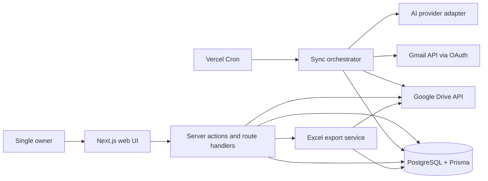
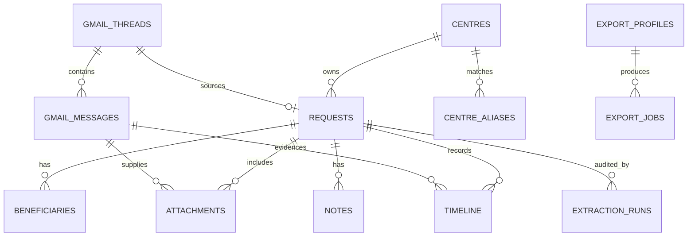

# KHOPS Referral Tracker — Architecture

**Status:** proposed architecture  
**Scope:** architecture only; no database, Gmail, AI, dashboard, export, or test module is implemented in this phase.

## 1. Product boundary

KHOPS Referral Tracker is a single-owner, modular web application that converts referral-incentive Gmail threads into an auditable PostgreSQL record. It monitors only the configured operations inbox, uses the official Gmail API with OAuth, stores a single request per source thread, tracks all beneficiaries separately, and derives approval progress from the content and order of Gmail messages rather than Gmail labels.

The first release is a modular monolith: one Next.js application, one PostgreSQL database, and managed Google/OpenAI integrations. This is the right level of operational complexity for one user while preserving explicit module boundaries for later integration into KHOPS.

## 2. Architecture decisions

| Decision | Chosen approach | Reason |
| --- | --- | --- |
| Application shape | Next.js 15 App Router modular monolith | Keeps UI, server actions, API routes, scheduled work, and deployment in one independently deployable unit. |
| Data access | Prisma with PostgreSQL | Typed schema, migrations, transactions, and portable persistence. |
| Gmail access | Gmail API with OAuth refresh token | Official API only; no browser automation or scraping. |
| Attachment storage | Google Drive application folder, referenced from PostgreSQL | Vercel local storage is ephemeral; Drive gives durable owner-controlled originals and downloads. |
| AI layer | Provider interface with OpenAI as the primary adapter and Gemini as an optional adapter | Avoids coupling the data model and workflow to one model provider. Exact model selection belongs to the approved AI module. |
| Sync scheduling | Vercel Cron invokes a protected internal endpoint; the database setting decides whether the run is due | Vercel schedules are deployment configuration, while the requested sync interval remains adjustable in Settings. |
| Status calculation | Rules + AI evidence over chronological Gmail thread messages | Gives predictable status transitions without depending on Gmail labels or exact subject text. |
| Exports | ExcelJS template/profile export | Allows the existing workbook’s sheet layout, columns, and styles to be reproduced after its template is supplied. |

## 3. System view



### Runtime flow

1. A scheduled call starts a uniquely identified sync run.
2. The Gmail adapter finds candidate messages, then reads complete relevant threads.
3. The ingestion service deduplicates the Gmail thread and individual messages before creating work.
4. Attachments are fetched through Gmail API, checksummed, copied to the configured Google Drive folder, and recorded.
5. The AI extraction service classifies the request and returns validated structured data with field-level evidence and confidence.
6. A database transaction creates or updates the request, beneficiaries, attachments, Gmail records, and extraction audit record.
7. The status detector evaluates every thread message chronologically and appends approval events to the timeline.
8. The dashboard and export services read the database only; they never query Gmail directly.

## 4. Module boundaries

Each module owns its own domain logic and exposes typed service contracts. UI routes must call services rather than embed Gmail, AI, or Prisma logic directly.

| Module | Responsibilities | Does not own |
| --- | --- | --- |
| `settings` | Encrypted integration configuration, sync controls, centre management, export profile selection | Gmail calls or extraction |
| `gmail` | OAuth lifecycle, Gmail search, message/thread retrieval, MIME parsing, attachment download, Gmail URL construction | Database presentation or UI |
| `documents` | Attachment classification, hashing, Drive archival, safe preview/download streaming | AI business decisions |
| `ingestion` | Idempotency, source-to-request orchestration, transactions, retries, sync run accounting | AI provider implementation |
| `extraction` | Candidate classification, email/document extraction, schema validation, confidence and evidence | Persistence details |
| `approval-status` | Thread message interpretation, transition rules, timeline event generation, status override audit | Gmail transport |
| `requests` | Search, filters, request details, notes, manual review and correction workflow | Scheduling |
| `dashboard` | Aggregate read models for cards and trend data | Source imports |
| `exports` | Workbook template/profile management and Excel generation | Gmail access |

### Proposed source layout

```text
src/
  app/
    (app)/dashboard/
    (app)/requests/
    (app)/settings/
    api/internal/sync/
    api/attachments/
    api/exports/
  features/
    dashboard/
    requests/
    settings/
  server/
    gmail/
    documents/
    ingestion/
    extraction/
    approval-status/
    exports/
    security/
  shared/
    schemas/
    types/
    constants/
prisma/
  schema.prisma
  migrations/
docs/
```

`features` may be moved into the KHOPS application later without moving server modules. Server module interfaces remain framework-neutral TypeScript where practical.

## 5. Gmail sync and idempotency design

### Candidate detection

The Gmail adapter starts with a broad subject-based Gmail search such as `in:anywhere subject:KH subject:"Referral Incentive"`, then uses the AI classifier to decide whether the message is a referral incentive request. It never relies on exact whole-subject matches, centre names, Gmail labels, or sender-specific rules.

The first sync performs a bounded historical search selected in Settings. Later syncs use the persisted Gmail history cursor where possible and fall back safely to an overlap search when Gmail history cannot be continued. Every run records its cursor, totals, and errors in `sync_logs`.

### Thread policy and duplicates

- `gmail_threads.gmail_thread_id` is unique.
- `gmail_messages.gmail_message_id` is unique.
- A request stores one primary source message and its Gmail thread.
- A known thread is re-read for status changes but does not create a second request.
- A known message is never re-imported.
- If a single Gmail thread genuinely contains two separate referral requests, ingestion flags it for manual split instead of silently creating a duplicate.

This makes retries safe. A failed run can be started again without duplicating requests, beneficiaries, attachments, or timeline events.

### Scheduling and concurrency

Vercel Cron calls `POST /api/internal/sync/run` on a fixed frequent schedule. The endpoint verifies `CRON_SECRET`, reads `sync_interval_minutes` from Settings (default `10`), and exits when a sync is not yet due. A PostgreSQL advisory lock or equivalent atomic sync lock permits only one active run. Work is paginated and checkpointed, so the next scheduled run can resume after a transient Gmail, Drive, or AI failure.

## 6. AI extraction architecture

The provider-neutral contract is intentionally narrow:

```ts
interface ReferralExtractionProvider {
  classifyCandidate(input: CandidateEmail): Promise<CandidateClassification>;
  extractRequest(input: ReferralSource): Promise<ReferralExtraction>;
  detectApprovalEvents(input: ThreadEvidence): Promise<ApprovalDetection>;
}
```

The OpenAI adapter and optional Gemini adapter both return the same Zod-validated JSON model. Provider/model/prompt versions are stored with every extraction run so results remain explainable when prompts or models change.

### Extraction rules

- Inputs include the plain-text email body, normalized HTML text, relevant headers, and all supported attachment content.
- Native PDF text is extracted when available; image and scanned-document content is supplied to the selected multimodal provider for OCR, tables, and form reading.
- `NORMAL` is one beneficiary; `SPECIAL` is multiple beneficiaries. The extractor may return either type, but `SPECIAL` is required when more than one beneficiary is found.
- Unknown values are `null`, never invented. Each extracted field carries confidence and source evidence.
- Low-confidence, contradictory, or incomplete results create a `needs_review` flag while preserving the original Gmail content and AI response for correction.
- Centre resolution uses the dynamic `centres` and `centre_aliases` data. An unfamiliar centre becomes a reviewable candidate; no centre list is compiled into code.

The AI module will choose the exact supported OpenAI model and validate provider capabilities when it is approved. This architecture does not hardcode an unverified model identifier.

## 7. Approval status architecture

The status detector evaluates the complete Gmail thread in ascending message time. It first applies configurable evidence rules, then uses the AI adapter only when language is ambiguous. It writes append-only timeline entries with the source Gmail message, evidence excerpt, confidence, and detection method.

| Status | Example evidence category |
| --- | --- |
| `RECEIVED` | Original request received in the operations inbox |
| `FORWARDED_TO_MANAGER` | Request forwarded or addressed to a manager for approval |
| `MANAGER_APPROVED` | Explicit manager approval |
| `WAITING_MARKETING_APPROVAL` | Awaiting marketing decision |
| `MARKETING_RECOMMENDED` | Explicit marketing recommendation |
| `FINAL_APPROVED` | Final approver confirms approval |
| `SENT_TO_CENTRE` | Approval/instructions sent back to the centre |
| `SENT_TO_FINANCE` | Payment request forwarded to finance |
| `PAID` | Payment confirmation or settlement evidence |

The request’s current status is a derived summary of its accepted timeline events, not a Gmail label. Corrections are permitted only as an explicitly recorded manual override event, so the original inferred status remains auditable.

## 8. Data model

All money values use PostgreSQL `numeric`/Prisma `Decimal`, never JavaScript floating point. Dates with no time of day use `date`; Gmail and audit timestamps use timezone-aware timestamps. Primary IDs should be UUIDs or ULIDs.

### Required application tables

| Table | Key fields and purpose |
| --- | --- |
| `requests` | Internal request ID, source Gmail thread/message references, subject, centre, patient, procedure, procedure details, discharge date, payment type, referral hospital/detail, type, current status, received date, Gmail URL, review state, extraction summary. |
| `beneficiaries` | Request FK, beneficiary type/name/contact, individual referral amount, currency, source confidence. One request has many rows. |
| `attachments` | Request and Gmail message FKs, Gmail attachment ID, filename, MIME type, size, checksum, attachment type, Drive file ID, preview/download state, extraction state. |
| `gmail_threads` | Unique Gmail thread ID, subject snapshot, latest message/history IDs, latest sync timestamp, raw thread metadata. |
| `timeline` | Request FK, status/event type, occurred timestamp, source Gmail message FK, detector, confidence, evidence, optional manual override metadata. |
| `notes` | Request FK, personal note content, created/updated timestamp. |
| `settings` | Singleton/key-value configuration, encrypted secret payloads, non-secret preferences, last successful sync markers. |
| `sync_logs` | Sync run ID, lifecycle, cursors, counts, duration, structured error and retry information. |

### Supporting tables needed for a production implementation

| Table | Why it is needed |
| --- | --- |
| `centres` | Unlimited user-managed centres with display name, active state, and review state. |
| `centre_aliases` | Maps subject/body spelling variants to a centre without hardcoding values. |
| `gmail_messages` | Unique Gmail message ID, thread FK, headers, sender/recipient metadata, sent/received time, normalized body, and Gmail permalink data. Necessary to audit status evidence at message level. |
| `extraction_runs` | Provider, model, prompt version, source hash, validated structured response, confidence summary, and failure/retry details. |
| `export_profiles` | Column mapping, template Drive file, per-centre sheet rules, and formatting version for the current Excel workbook. |
| `export_jobs` | Requested period, profile, generated Drive file, status, checksum, and audit timestamp. |

### Relationships



### Essential indexes and constraints

- Unique: Gmail thread ID, Gmail message ID, attachment `(gmail_message_id, gmail_attachment_id)`, setting key, centre alias per normalized value.
- Search: PostgreSQL full-text/trigram indexes over patient, procedure, hospital, and beneficiary name; normal indexes for centre, status, received date, payment type, beneficiary type, and amount.
- Referential integrity: beneficiaries, notes, timeline, extraction runs, and attachments always reference a request; raw Gmail records are retained while their request exists.
- Auditability: source IDs, detection evidence, extraction response hashes, and manual corrections are immutable after creation.

## 9. Web application and APIs

### Pages

| Route | Purpose |
| --- | --- |
| `/dashboard` | Pending, approved, special requests, monthly total, this-month amount, total requests, and pending requests. |
| `/requests` | Searchable/filterable request table: patient, centre, procedure, doctor, amount, status, received date, and Open Gmail action. |
| `/requests/[requestId]` | Patient information, beneficiaries, attachments, timeline, original email, approval chain, extraction warnings, and personal notes. |
| `/settings` | OAuth connection, encrypted provider configuration, sync interval, Drive/export destination, centre management, and sync health. |

### Server-only endpoints

- `POST /api/internal/sync/run` — protected cron/manual sync trigger.
- `GET /api/requests` and `GET /api/requests/:id` — typed list/detail data for internal UI use.
- `POST /api/requests/:id/notes` — add or edit a personal note.
- `GET /api/attachments/:id` — authorization-gated Drive stream/download; no permanent public Drive URL.
- `POST /api/exports` and `GET /api/exports/:id` — start and retrieve an Excel export.
- `GET /api/settings/google/connect` and OAuth callback — connect the single permitted Google account.

All external input and AI responses are parsed through Zod schemas before business logic or database writes.

## 10. Storage, secrets, and privacy

This application handles patient information and financial amounts. “No application login” must not mean public access.

- Protect the deployed app at the network/deployment layer (for example, Vercel deployment protection or an access proxy) until application authentication is introduced.
- Restrict Gmail OAuth to the configured operations account and request only the scopes required for read-only Gmail access and the application’s Drive folder.
- Keep the OAuth refresh token, AI API key, and Google client credentials encrypted in `settings`; the encryption master key is a Vercel environment secret and is never stored in PostgreSQL.
- Do not place Gmail bodies, attachment contents, OAuth tokens, API keys, or AI prompts in application logs.
- Store Drive file IDs and metadata in PostgreSQL; proxy previews/downloads through the app so raw Drive links remain private.
- Define backup, retention, deletion, and AI data-processing policies before first production import. The selected AI provider must be acceptable for the medical/financial data being sent to it.
- Separate development and production Google OAuth clients, databases, Drive folders, and API keys.

## 11. Deployment and configuration

### Required deployment services

- Vercel: Next.js hosting and cron trigger.
- Managed PostgreSQL: production database with automated backups.
- Google Cloud project: Gmail API, Drive API, OAuth consent configuration, and redirect URI.
- Google Drive folder: private archive for raw referral attachments and exported workbooks.
- OpenAI account/API key: primary extraction provider when the AI module is approved.

### Environment-owned secrets

```text
DATABASE_URL
APP_ENCRYPTION_KEY
CRON_SECRET
NEXT_PUBLIC_APP_URL
```

Provider credentials are configured through Settings and encrypted using `APP_ENCRYPTION_KEY`. Non-secret Settings include the permitted Gmail address, sync interval, Drive folder IDs, export profile, first-sync date, and review thresholds.

Vercel cannot safely retain a server-local export folder. In production, “Export Folder” means the configured Google Drive folder plus a browser download. A local filesystem export folder is supported only for local/self-hosted operation.

## 12. Observability and recovery

- Each sync and export has a visible run record with started/finished time, counts, warnings, error category, and retry state.
- Failures in one attachment or extraction do not discard the Gmail thread; they create a resumable failed item with the source still preserved.
- Dashboards read persisted records and expose last successful sync, active failure count, and items needing review.
- Health checks cover database connectivity, OAuth token refresh, Gmail access, Drive access, and AI provider connectivity without exposing secrets.
- A manual “Sync now” action uses the same idempotent workflow as Cron.

## 13. Delivery sequence and approval gates

| Phase | Deliverable | Starts only after approval |
| --- | --- | --- |
| 1 — Architecture | This document and confirmed design decisions | Complete now |
| 2 — Database | Prisma schema, migrations, seed-free configuration, repository/services | Yes |
| 3 — Gmail Sync | OAuth connection, Gmail ingest, Drive archival, idempotent scheduled sync | Yes |
| 4 — AI Extraction | Provider adapter, document extraction, confidence/review workflow, status detection | Yes |
| 5 — Dashboard | Request list/search/filter/detail/notes/dashboard UI | Yes |
| 6 — Excel Export | Template profile, per-centre sheets, one-click export | Yes |
| 7 — Testing | Unit, integration, mocked Gmail/AI, and end-to-end coverage | Yes |

## 14. Inputs required before later modules

1. **Database phase:** PostgreSQL connection target (local, Neon, Supabase Postgres, or other managed provider).
2. **Gmail phase:** Google Cloud OAuth client, approved redirect URL, and access to the single operations Gmail account.
3. **AI phase:** chosen provider and account credentials; the exact model must be confirmed against the provider’s then-current supported API models.
4. **Export phase:** a copy of the current Excel workbook, including every centre sheet and representative data, so column order, styles, formulas, widths, and totals can be reproduced exactly.

## 15. Architecture acceptance criteria

- No hardcoded centre list, subject variants, Gmail labels, or spreadsheet columns are required by core logic.
- One request supports one or many beneficiaries and correctly totals their independently stored amounts.
- Re-running sync is safe and does not duplicate Gmail threads, messages, attachments, requests, beneficiaries, or timeline events.
- Every extracted value and status can be traced to a Gmail message/attachment and its confidence.
- The web UI, sync process, extraction provider, and export engine can evolve independently and later be integrated into KHOPS.
- Credentials and sensitive referral data are protected despite the initial absence of application login.
